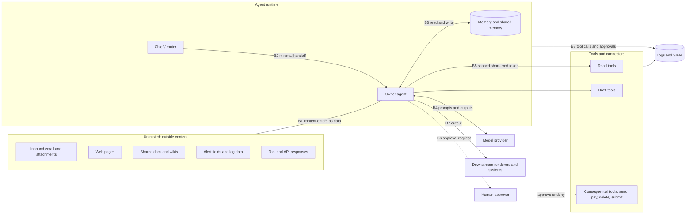

# Threat model: AI agents as privileged identities

This threat model covers an AI agent that reads untrusted content, holds tools and
credentials, keeps memory, and acts for a person or a team. It ties the
[operating model](operating-model.md) to the four skills in [`skills/`](../skills/):

- [`soc-alert-triage`](../skills/soc-alert-triage/SKILL.md)
- [`untrusted-content-guard`](../skills/untrusted-content-guard/SKILL.md)
- [`access-review`](../skills/access-review/SKILL.md)
- [`ai-governance-checklist`](../skills/ai-governance-checklist/SKILL.md)

It's written for two readers: me, running a small personal multi-agent assistant, and a
security team that wants to deploy agents at work. Every name, domain, account, and number
here is fictional.

**Frameworks checked on 2026-10-04:**
- OWASP Top 10 for LLM Applications 2026, released 4 Aug 2026. The IDs match the rest of
  this repo.
- MITRE ATLAS data, content version 2026.09 (format 6.0.0, modified 2026-09-15). Every ATLAS
  ID below was checked against that release, along with its tactic.

IDs change between releases, so verify them before citing anything formally.

## 1. Scope and method

**In scope:**
- the agents and their role cards
- routing and handoffs between agents
- memory
- tools, connectors, and the credentials behind them
- the model provider connection
- the human approval path
- outputs that reach people or other systems
- logs and the SIEM

**Out of scope:**
- attacks on model training (we don't train models)
- physical access
- compromise of the host operating system (handled by normal endpoint controls)
- the internal security of each SaaS service the agents connect to

**Method.** The steps:
1. List the assets.
2. Draw the trust boundaries.
3. Name the threat actors.
4. Walk each threat. For each one, give its OWASP and ATLAS mappings, the mitigations, the
   control that owns each mitigation, and detection ideas.

The control IDs used throughout:

| Prefix | Meaning | Where |
|---|---|---|
| OM §n | A section of the operating model | [`operating-model.md`](operating-model.md) |
| UCG Dn | A pattern in the untrusted-content-guard detection checklist | [`untrusted-content-guard`](../skills/untrusted-content-guard/SKILL.md) |
| AR Fn | An access-review check | [`access-review`](../skills/access-review/SKILL.md) |
| GC-nn | An AI governance control | [`ai-governance-checklist`](../skills/ai-governance-checklist/SKILL.md) |
| SAT | The SOC alert triage procedure | [`soc-alert-triage`](../skills/soc-alert-triage/SKILL.md) |

The core assumption: **prompt injection is not solved.** A model can be talked into
anything. So the real limits are on what the agent can do (capabilities), not on what it
believes (instructions). Detection of injected text helps, but every high-impact threat
below also has a control that works even when the model is fooled.

## 2. Assets

| # | Asset | Why it matters | Where it lives |
|---|---|---|---|
| A1 | The human's accounts and data (mail, calendar, documents, financial views) | Confidentiality and integrity. The agent reads them on someone's behalf | SaaS services behind connectors |
| A2 | Agent credentials (tokens, service accounts, connector grants) | They turn a fooled model into real actions | Secrets manager or connector platform, never in memory |
| A3 | Ability to act externally (send, publish, pay, submit, delete, widen access) | The highest-impact capability | Tools gated by the approval matrix (OM §8) |
| A4 | Agent memory (profile, log, short-lived notes, shared memory) | Persistent influence over future behavior | Memory store per agent plus shared memory (OM §4) |
| A5 | Instructions and hidden context (role cards, system instructions, skill files, tool schemas) | Reveals logic and boundaries; must not hold secrets | Repo and agent configuration |
| A6 | Retrieval sources and indexes | Shape answers; may hold content some users shouldn't see | Wikis, drives, help centers, vector stores |
| A7 | Audit evidence (tool-call logs, approvals, findings) | Accountability and incident reconstruction | Agent logs forwarded to the SIEM (OM §9) |
| A8 | Security decisions (alert dispositions, access certifications, governance recommendations) | A wrong call either hides an attack or harms a person | Skill outputs reviewed by a human |
| A9 | Budget and availability (API spend, rate limits, the human's attention) | Runaway loops and alert fatigue are real costs | Model provider account, routines (OM §6) |

## 3. Trust boundaries



| Boundary | What crosses it | Main control |
|---|---|---|
| B1 Outside content → agent | Text, files, and tool output that may carry instructions | Untrusted content is data, never instructions (OM §7, UCG) |
| B2 Router → owner agent | A minimal context packet: task, facts, deadline | One owner per task; no forwarding of whole threads or memory dumps (OM §3) |
| B3 Agent ↔ memory | Facts that persist across tasks | Tiered memory, nothing secret, conflicts logged or escalated (OM §4) |
| B4 Agent ↔ model provider | Prompts, context, outputs | Vendor terms, model version tracking (GC-09, GC-25) |
| B5 Agent → tools | Credentials and calls | Least-privilege, short-lived scoped tokens; allowlisted connectors (OM §7, GC-10, AR F10) |
| B6 Agent → human → consequential tool | The approval request and decision | Approval matrix; denial is final (OM §7, §8, GC-15) |
| B7 Agent → downstream | Notes, drafts, events, rendered output | Output handling (GC-19); draft before send (OM §7) |
| B8 Agent → logs | Tool calls, approvals, flags | Logging without secrets; weekly self-audit; SIEM detections (OM §9, GC-17) |

## 4. Threat actors

| Actor | Goal | Typical entry point |
|---|---|---|
| **External content author** (phisher, malicious site, hostile vendor contact) | Make the agent act or leak data | B1: email, web page, attachment |
| **Attacker inside the monitored environment** | Hide activity or mislead the SOC | B1: attacker-controlled alert fields (user agents, command lines, file names) read by `soc-alert-triage` |
| **Insider with write access to shared content** (careless or malicious) | Plant instructions or false facts that reach many users | A6: an editable wiki or shared drive that gets indexed |
| **Compromised or malicious supply chain** (tool, connector, skill, model update) | Persist, harvest credentials, change behavior quietly | B4 and B5: tool definitions, tool responses, unannounced model changes |
| **Credential thief** | Use the agent's identity directly, without going through the model | A2: tokens in config, logs, or memory; phished consent or device-code flows |
| **Self-approver or rushed team** (governance, not malice) | Ship an agent without review | GC-02, GC-20: self-approval, unreviewed scope changes |
| **The model itself** (no adversary needed) | n/a. It confabulates, overstates confidence, or loops | Every boundary. This is the most frequent "actor" in practice |

## 5. Threats

### Summary

| ID | Threat | OWASP LLM 2026 | MITRE ATLAS (verified) | Primary controls |
|---|---|---|---|---|
| T1 | Indirect prompt injection leads to an unwanted action | LLM01, LLM03 | AML.T0051.001, AML.T0053, AML.T0068, AML.T0094 | OM §7, §8; UCG; GC-10, GC-12, GC-15 |
| T2 | Data exfiltration through a tool or rendered output | LLM02, LLM10 | AML.T0086, AML.T0077, AML.T0057 | OM §7, §8; UCG D6, D13; GC-19 |
| T3 | Over-scoped or stolen agent credentials | LLM03 | AML.T0083, AML.T0098, AML.T0055, AML.T0091.000, AML.T0012 | OM §7; AR F8, F9, F10; GC-10 |
| T4 | Memory and context poisoning | LLM01 | AML.T0080.000, AML.T0080.001, AML.T0051.002 | OM §4; UCG D11, D12 |
| T5 | Retrieval poisoning and permission bypass | LLM09, LLM05, LLM02 | AML.T0070, AML.T0066, AML.T0099, AML.T0085.000 | GC-08, GC-23 |
| T6 | Tool, connector, and model supply chain | LLM04 | AML.T0010.005, AML.T0110.002, AML.T0109 | OM §7; GC-09, GC-20, GC-25 |
| T7 | Hidden context exposure | LLM08 | AML.T0056, AML.T0069.002, AML.T0084.001 | OM §4; GC-12 |
| T8 | Misleading approval requests and approval fatigue | LLM01, LLM07 | AML.T0051.001 (when content-driven) | OM §8; GC-15, GC-22 |
| T9 | Confident but wrong security decisions | LLM07 | AML.T0130 (when adversary-driven) | SAT; AR; GC-11, GC-15 |
| T10 | Destructive or irreversible actions | LLM03 | AML.T0101, AML.T0048.000 | OM §7, §8; GC-15, GC-18 |
| T11 | Runaway loops and unbounded consumption | LLM06 | AML.T0034.002, AML.T0029 | OM §6, §7 (stop condition); GC-17 |
| T12 | Cross-agent confused deputy | LLM01, LLM03 | AML.T0053 | OM §3, §4 |
| T13 | Audit gaps, secrets in logs, covered tracks | LLM02 | AML.T0092, AML.T0081 | OM §9; GC-17, GC-18 |
| T14 | Governance drift: shadow agents, self-approval, stale access | LLM03, LLM04 | AML.T0012 (dormant credentials) | GC-01, GC-02, GC-20, GC-21; AR F9, F10 |

ATLAS tactics for the techniques above, from the 2026.09 data:

| Tactic | Techniques |
|---|---|
| Execution | AML.T0051 and its sub-techniques; AML.T0053 (also Privilege Escalation and Lateral Movement) |
| Defense Evasion | AML.T0068; AML.T0094; AML.T0109; AML.T0092; AML.T0081 (also Persistence) |
| Exfiltration | AML.T0086; AML.T0077; AML.T0057; AML.T0056 |
| Credential Access | AML.T0083; AML.T0098; AML.T0055 |
| Persistence | AML.T0080 and its sub-techniques; AML.T0070; AML.T0099; AML.T0110.002 |
| Collection | AML.T0085.000 |
| Discovery | AML.T0069.002; AML.T0084.001 |
| Initial Access | AML.T0010.005; AML.T0012 (also Privilege Escalation and Lateral Movement) |
| Lateral Movement | AML.T0091.000 |
| Impact | AML.T0101; AML.T0048.000; AML.T0034.002; AML.T0029; AML.T0130 |
| AI Attack Adaptation | AML.T0066 |

### Detection data used below

The searches assume each tool call becomes one event in a fictional sourcetype,
`secure_agent_ops:agent_audit`, with these fields:

| Field | Example |
|---|---|
| `agent` | `agent-exec-assistant` |
| `task_id` | `task-20261004-0193` |
| `tool` | `mail.send` |
| `action_class` | `read`, `draft`, `consequential`, `memory_write`, `config_change` |
| `target`, `target_domain` | `invoices@vendor.example.net`, `vendor.example.net` |
| `approval_id`, `approval_decision` | `apr-0412`, `approved` / `denied` / blank |
| `invoked_by` | `routine:inbox-digest` or `human` |
| `content_trust` | `trusted` or `untrusted` (any untrusted content in the task context) |
| `injection_flag`, `ucg_patterns` | `true`, `["D4","D6"]` (from `untrusted-content-guard`) |
| `credential_id`, `scope` | `tok-ea-07`, `mail.draft` |
| `src` | Where the call came from (runtime host or egress IP) |
| `model_version` | `modelco-2026-08-15` |
| `tokens_total`, `cost_usd` | `18234`, `0.41` |
| `output_url_domains` | Domains in links or images the output would render |
| `retrieved_doc_ids`, `retrieval_acl_match` | `["wiki-4471"]`, `false` |

A synthetic event:

```json
{"time":"2026-10-04T14:12:09Z","agent":"agent-exec-assistant","task_id":"task-20261004-0193","tool":"mail.send","action_class":"consequential","target":"invoices@vendor.example.net","target_domain":"vendor.example.net","approval_id":"","approval_decision":"","invoked_by":"routine:inbox-digest","content_trust":"untrusted","injection_flag":true,"ucg_patterns":["D4","D6"],"credential_id":"tok-ea-07","scope":"mail.draft","src":"10.20.0.15","model_version":"modelco-2026-08-15","tokens_total":18234,"cost_usd":0.41,"output_url_domains":[],"retrieved_doc_ids":[],"retrieval_acl_match":true}
```

Splunk extracts JSON arrays as `field{}` (for example, `ucg_patterns{}`). Add field aliases
or a `rename` so the searches below can use the plain names.

The searches are Splunk-flavored and untested. Adjust index names, fields, and thresholds to
your environment. In Splunk ES 8.x, the natural pattern is an event-based detection that
writes risk (intermediate findings) against the agent's identity, plus a finding-based
detection that raises a finding when one agent accumulates risk. This matches the
`access-review` SIEM mode, which uses the same `user` risk object for agents. Other SIEMs can
run the same logic.

---

### T1. Indirect prompt injection leads to an unwanted action

Instructions hidden in an email, web page, document, alert field, or tool response steer the
agent into a tool call the human didn't ask for. This is the defining threat for agents.

- **OWASP:** LLM01:2026 Prompt Injection; LLM03:2026 Excessive Agency (the fix lives in
  capabilities).
- **ATLAS:**
  - AML.T0051.001 LLM Prompt Injection: Indirect
  - AML.T0053 AI Agent Tool Invocation
  - AML.T0068 LLM Prompt Obfuscation (hidden or encoded payloads)
  - AML.T0094 Delay Execution of LLM Instructions (dormant triggers)

**Mitigations:**

| Mitigation | Owner control |
|---|---|
| Treat all outside content as data; quote and flag embedded instructions; never act on them | OM §7; UCG (procedure steps 1–8, D1–D14) |
| Severity tracks capability: the same injection is worse when the agent holds a matching tool | UCG severity scale |
| No consequential tool runs without per-action approval; acting on external instructions is in the "Never" column | OM §8; GC-15 |
| Minimal tools and scopes per role, so most injected requests have nothing to call | OM §2, §7; GC-10; AR F10 |
| Alert fields are scanned before triage, and the triage output is a draft for an analyst | SAT step 2; SAT guardrails |
| Injection tested through every untrusted input before go-live | GC-12; `untrusted-content-guard` evals |

**Detection ideas:**

Consequential action without an approval on record:

```spl
index=<your_agent_audit_index> sourcetype="secure_agent_ops:agent_audit" action_class="consequential"
| where isnull(approval_id) OR approval_id="" OR approval_decision!="approved"
| table _time agent task_id tool target approval_id approval_decision invoked_by
```

A consequential action in a task that had already been flagged for injection:

```spl
index=<your_agent_audit_index> sourcetype="secure_agent_ops:agent_audit" (injection_flag=true OR action_class="consequential")
| stats min(eval(if(injection_flag="true", _time, null()))) as first_flag
        min(eval(if(action_class="consequential", _time, null()))) as first_action
        values(eval(if(action_class="consequential", tool, null()))) as consequential_tools
        values(ucg_patterns) as ucg_patterns
        by agent task_id
| where isnotnull(first_flag) AND isnotnull(first_action) AND first_action >= first_flag
```

The second search should be zero by design. Any hit means a control failed, not just that
the model was fooled.

---

### T2. Data exfiltration through a tool or rendered output

Injected content tells the agent to forward data, call a URL with data in it, or produce
markdown whose image or link URL carries data. That URL fires when the output is rendered.

- **OWASP:** LLM02:2026 Sensitive Information Disclosure; LLM10:2026 Improper Output
  Handling.
- **ATLAS:**
  - AML.T0086 Exfiltration via AI Agent Tool Invocation
  - AML.T0077 LLM Response Rendering
  - AML.T0057 LLM Data Leakage

**Mitigations:**

| Mitigation | Owner control |
|---|---|
| Sending, forwarding, and new recipients need approval; drafts are the default | OM §7, §8 |
| Flag tool retargeting (new recipient or endpoint) and URLs that carry data | UCG D6, D13 |
| Outputs never auto-fetch external images or links; outputs to other systems are validated | GC-19 |
| Mask or minimize personal data at the prompt and output boundary | GC-14 |
| Connectors allowlisted; a new egress destination is a change | OM §7 |

**Detection ideas:**

Tool calls to a destination outside the allowlist:

```spl
index=<your_agent_audit_index> sourcetype="secure_agent_ops:agent_audit" tool IN ("mail.send","mail.forward","http.post","webhook.post")
| lookup agent_egress_allowlist.csv domain AS target_domain OUTPUT allowed
| where isnull(allowed)
| stats count earliest(_time) as first_seen values(tool) as tools values(task_id) as tasks by agent target_domain
```

Rendered output that points at a domain never seen before:

```spl
index=<your_agent_audit_index> sourcetype="secure_agent_ops:agent_audit" output_url_domains=* earliest=-30d
| mvexpand output_url_domains
| stats earliest(_time) as first_seen count by output_url_domains agent
| where first_seen >= relative_time(now(), "-24h")
```

---

### T3. Over-scoped or stolen agent credentials

The agent holds more scope than its role card allows, or its token leaks (config files,
logs, memory, a phished consent or device-code prompt) and is used without the model at all.

- **OWASP:** LLM03:2026 Excessive Agency.
- **ATLAS:**
  - AML.T0083 Credentials from AI Agent Configuration
  - AML.T0098 AI Agent Tool Credential Harvesting
  - AML.T0055 Unsecured Credentials
  - AML.T0091.000 Use Alternate Authentication Material: Application Access Token
  - AML.T0012 Valid Accounts

**Mitigations:**

| Mitigation | Owner control |
|---|---|
| Short-lived, narrowly scoped tokens per agent and per tool, requested at runtime, never stored | OM §4, §7; GC-10 |
| No secrets in memory, logs, or hidden context | OM §4 "Never in memory", §9; GC-17 |
| Agents are in the access review: scope beyond role card, stale tokens, missing owner | AR F8, F9, F10; reviewer independence |
| Widening a scope or adding a connector needs approval | OM §8 |
| Approve only device codes and consent prompts you started yourself | OM §7 (device-code login); residual risk R6 |

**Detection ideas:**

A scope in use that the role card doesn't allow. `agent_role_cards.csv` is a lookup
generated from `agents/`:

```spl
index=<your_agent_audit_index> sourcetype="secure_agent_ops:agent_audit"
| lookup agent_role_cards.csv agent scope OUTPUT allowed AS scope_allowed
| where isnull(scope_allowed)
| stats count values(tool) as tools latest(_time) as last_seen by agent credential_id scope
```

An agent token used from a new source:

```spl
index=<your_agent_audit_index> sourcetype="secure_agent_ops:agent_audit" earliest=-30d
| stats earliest(_time) as first_seen by credential_id src
| where first_seen >= relative_time(now(), "-1d")
```

Route `access-review` findings F9 and F10 into the same risk object so stale or over-scoped
agents and live misuse score together.

---

### T4. Memory and context poisoning

Content tells the agent to "remember" a rule or false fact. Or a poisoned fact enters shared
memory and wins the "newest fact" rule. Either way, the influence persists into later tasks
and other agents.

- **OWASP:** LLM01:2026 Prompt Injection (delivery). Agent memory is covered more directly
  by the OWASP Top 10 for Agentic Applications. That list isn't mapped here because its IDs
  weren't verified for this document.
- **ATLAS:**
  - AML.T0080.000 AI Agent Context Poisoning: Memory
  - AML.T0080.001 AI Agent Context Poisoning: Thread
  - AML.T0051.002 LLM Prompt Injection: Triggered

**Mitigations:**

| Mitigation | Owner control |
|---|---|
| Never write instructions from content into memory; flag persistence and dormant triggers | UCG D11, D12 |
| Memory holds facts with a named source and date; conflicts are logged or escalated, never silently resolved | OM §4 |
| Short-lived notes expire; profile memory is reviewed quarterly; monthly memory review routine | OM §4, §6 |
| Each agent writes only its own slice of shared memory | OM §4 |

**Detection ideas:**

Memory writes made during tasks that read untrusted content:

```spl
index=<your_agent_audit_index> sourcetype="secure_agent_ops:agent_audit" action_class="memory_write" content_trust="untrusted"
| table _time agent task_id target ucg_patterns injection_flag
```

Review every hit in the weekly self-audit (OM §9). A hit with `injection_flag=true` should
never happen.

---

### T5. Retrieval poisoning and permission bypass

Someone edits an indexed page so that it carries instructions or false facts. Or the
retrieval layer runs as one broad service account and returns content the asking user
couldn't open.

- **OWASP:**
  - LLM09:2026 Vector and Embedding Weaknesses
  - LLM05:2026 Data and Model Poisoning
  - LLM02:2026 Sensitive Information Disclosure
- **ATLAS:**
  - AML.T0070 RAG Poisoning
  - AML.T0066 Retrieval Content Crafting
  - AML.T0099 AI Agent Tool Data Poisoning
  - AML.T0085.000 Data from AI Services: RAG Databases

**Mitigations:**

| Mitigation | Owner control |
|---|---|
| Retrieval enforces each source's permissions for the asking user | GC-23 |
| Write access to indexed sources and changes to the crawl list are controlled and reviewed | GC-23, GC-20 |
| Ingested content screened for hidden instructions; retrieved text treated as untrusted | GC-23; UCG |
| Data sources documented with provenance and retention | GC-08 |
| Unexplained behavior shifts after a data change are handled as possible poisoning incidents | GC-17, GC-18 ("Drift or poisoning?") |

**Detection ideas:**

Retrieval that returned documents the user couldn't open. This needs the retrieval layer to
log an ACL check result:

```spl
index=<your_agent_audit_index> sourcetype="secure_agent_ops:agent_audit" retrieval_acl_match=false
| stats count values(retrieved_doc_ids) as docs by agent invoked_by
```

Also join wiki or drive audit logs on recently edited pages that are now being retrieved
often. Recent edits by accounts that rarely edit are worth a look.

---

### T6. Tool, connector, and model supply chain

A connector or skill ships a malicious update. A tool returns poisoned responses. Or the
model provider changes the model without notice, so earlier tests no longer describe what's
running.

- **OWASP:** LLM04:2026 Supply Chain.
- **ATLAS:**
  - AML.T0010.005 AI Supply Chain Compromise: AI Agent Tool
  - AML.T0110.002 AI Agent Tool Poisoning: Runtime Response
  - AML.T0109 AI Supply Chain Rug Pull

**Mitigations:**

| Mitigation | Owner control |
|---|---|
| Connectors allowlisted; a new connector or a scope change is a reviewed change | OM §7, §8 |
| Tool responses are untrusted content, including from "internal" tools | UCG trust boundaries |
| Vendor terms, change notice, and incident notice reviewed | GC-09 |
| Component record and pinned or tracked model version; provider-side updates trigger re-assessment | GC-25, GC-20 |
| Skills versioned in git with eval cases | OM §5 |

**Detection ideas:**

Model version changes per agent:

```spl
index=<your_agent_audit_index> sourcetype="secure_agent_ops:agent_audit" earliest=-7d
| stats dc(model_version) as versions values(model_version) as model_versions by agent
| where versions > 1
```

Treat a hit as a change-management event (GC-20), not an incident. Re-run the evals. Also
alert on any tool name that isn't on the allowlist lookup.

---

### T7. Hidden context exposure

Someone extracts the system instructions, role cards, or tool schemas. That's only harmful
if they hold secrets or are the only thing enforcing a rule.

- **OWASP:** LLM08:2026 Hidden Context Exposure.
- **ATLAS:**
  - AML.T0056 Extract LLM System Prompt
  - AML.T0069.002 Discover LLM System Information: System Prompt
  - AML.T0084.001 Discover AI Agent Configuration: Tool Definitions

**Mitigations:**

| Mitigation | Owner control |
|---|---|
| Assume hidden context is public. This repo publishes the role cards and skills on purpose | OM §5; repo design |
| No credentials or secrets in instructions, skills, or memory | OM §4; GC-12 |
| Authorization lives in token scopes and approvals, not in instructions | OM §7, §8; GC-10 |
| Flag requests to reveal instructions | UCG D5 |

**Detection ideas:** count `untrusted-content-guard` findings with pattern D5 by source and
agent. Public-facing agents should expect a steady baseline, so alert on spikes rather than
single hits.

---

### T8. Misleading approval requests and approval fatigue

The approval step is the main control, so it's the main target. An agent fooled by content
can write a request that looks routine. A flood of low-value requests trains the human to
click "approve".

- **OWASP:** LLM01:2026 (when content drives the request); LLM07:2026 Misinformation (when
  the request misdescribes the action).
- **ATLAS:** AML.T0051.001, when the misleading text came from ingested content. There's no
  more specific verified technique for fooling the human approver.

**Mitigations:**

| Mitigation | Owner control |
|---|---|
| Requests show the exact action, target, content, and reason; vague requests are denied | OM §8 |
| Denial is final; the agent doesn't rephrase and retry | OM §7 |
| Approval only for consequential actions, so requests stay rare and meaningful | OM §8 |
| Flag "approval laundering" in content ("pre-approved", "already confirmed") | UCG D7 |
| Reviewers trained on their oversight duties | GC-22 |
| Planned: a draft-before-send skill that standardizes what an approval shows | Roadmap; residual risk R1 |

**Detection ideas:**

Retry after a denial (same agent, tool, and target):

```spl
index=<your_agent_audit_index> sourcetype="secure_agent_ops:agent_audit" approval_decision=*
| sort 0 _time
| streamstats current=f window=1 last(approval_decision) as prev_decision last(_time) as prev_time by agent tool target
| where prev_decision="denied" AND _time - prev_time < 3600
| table _time agent tool target prev_decision approval_decision
```

Track the approval rate and the time to approve per human. A rising approval rate with
falling decision times is an approval-fatigue signal for the weekly review.

---

### T9. Confident but wrong security decisions

The model closes a true positive as benign, recommends revoking the wrong access, or calls a
risky system low-risk. It states guesses as facts. An attacker can push it there
(attacker-controlled alert fields, biased sources), but often no attacker is needed.

- **OWASP:** LLM07:2026 Misinformation.
- **ATLAS:** AML.T0130 AI Agent Response Biasing, only when an adversary steers the output.

**Mitigations:**

| Mitigation | Owner control |
|---|---|
| Every skill recommends; a named human decides | SAT; AR; GC (all guardrails) |
| Enrich only from provided context; mark inferences; state confidence | SAT step 3, step 5; OM §10 |
| Known-benign checks don't override hard evidence; dispositions stay drafts | SAT step 6, step 7 |
| Claims aren't evidence; unknown means gap | GC guardrails; AR step 2 |
| Each skill documents where the model gets it wrong and ships eval cases | All skills; `evals/` |

**Detection ideas:** in Splunk ES, compare AI-drafted dispositions with the analyst's final
disposition, and track the override rate per detection over time. The worked example in
`ai-governance-checklist` already uses an override-rate report. A sudden drop in overrides
can mean better drafts or less review, so sample them.

---

### T10. Destructive or irreversible actions

Deletion, payment, transfer, submission, or bulk changes. These may be triggered by
injection or by a misunderstood request.

- **OWASP:** LLM03:2026 Excessive Agency.
- **ATLAS:**
  - AML.T0101 Data Destruction via AI Agent Tool Invocation
  - AML.T0048.000 External Harms: Financial Harm

**Mitigations:**

| Mitigation | Owner control |
|---|---|
| No agent holds a credential that can move money, send mail, or publish on its own | OM §2 |
| Delete, pay, submit, and transfer need approval | OM §8; GC-15 |
| Multi-step submissions drafted offline; the human does the final step | OM §10 |
| Kill switch and rollback plan | GC-18 |

**Detection ideas:**
- Any `tool` in the delete, pay, or submit family with `approval_decision!="approved"`.
  This is the T1 search, scoped to those tools.
- Bulk mutation: more than N mutating calls per task in 10 minutes.

---

### T11. Runaway loops and unbounded consumption

An agent retries the same failing approach, escalates to heavier tools, or is coerced into
expensive calls. This burns budget and the human's attention.

- **OWASP:** LLM06:2026 Unbounded Consumption.
- **ATLAS:**
  - AML.T0034.002 Cost Harvesting: Agentic Resource Consumption
  - AML.T0029 Denial of AI Service

**Mitigations:**

| Mitigation | Owner control |
|---|---|
| Every task has a stop condition; no loops and no workarounds around a control | OM §7 |
| Routines are read-only, quiet unless something matters, and reviewed if unused | OM §6 |
| Cost and volume monitored | GC-17 |

**Detection ideas:**

```spl
index=<your_agent_audit_index> sourcetype="secure_agent_ops:agent_audit"
| bin _time span=15m
| stats count as calls sum(cost_usd) as cost dc(tool) as tools by _time agent task_id
| where calls > 50 OR cost > 5
```

Tune the thresholds to each agent's baseline.

---

### T12. Cross-agent confused deputy

One agent's output, shaped by content it read, becomes another agent's input. The second
agent treats it as trusted because it came from "inside". Or a copied agent acts on an item
it was only meant to watch.

- **OWASP:** LLM01:2026; LLM03:2026.
- **ATLAS:** AML.T0053 AI Agent Tool Invocation, where the second agent's tool is the
  target. No more specific verified technique fits a single-owner, multi-agent design.

**Mitigations:**

| Mitigation | Owner control |
|---|---|
| One owner per task; the owner is named in the handoff; copied agents comment but don't act | OM §3 |
| Minimal context packets, not whole threads or memory dumps | OM §3 |
| Disagreements go up to the human, not sideways | OM §3 |
| Content that came from outside stays labeled untrusted across handoffs | UCG trust boundaries; residual risk R4 |

**Detection ideas:** consequential or memory-write calls by an agent that isn't the
recorded owner of the `task_id`. This needs the router to log ownership.

---

### T13. Audit gaps, secrets in logs, covered tracks

Logs miss the fields needed to reconstruct an incident, or contain secrets. Or an attacker
(or a fooled agent) edits chat history or agent configuration so the trail goes cold.

- **OWASP:** LLM02:2026 (secrets or personal data in logs).
- **ATLAS:**
  - AML.T0092 Manipulate User LLM Chat History
  - AML.T0081 Modify AI Agent Configuration

**Mitigations:**

| Mitigation | Owner control |
|---|---|
| Every tool call logged with time, agent, tool, target, and result; approvals logged beside the action | OM §9 |
| Logs never hold secrets; reference and summary instead of full bodies | OM §9 |
| Enterprise systems keep a defined incident evidence set (input, context, output, model version, retrieved sources, both identities) | GC-17, GC-18 |
| Disabling logging or bypassing an approval is in the "Never" column | OM §8 |
| Weekly self-audit read like an access review | OM §9 |

**Detection ideas:**

An agent that has gone quiet (possible logging failure):

```spl
index=<your_agent_audit_index> sourcetype="secure_agent_ops:agent_audit" earliest=-7d
| stats latest(_time) as last_seen by agent
| where last_seen < relative_time(now(), "-24h")
```

Also alert on any event with `action_class="config_change"`, and run a regex-based secrets
check on the audit index, tuned to your own token formats.

---

### T14. Governance drift: shadow agents, self-approval, stale access

Agents appear without review, gain tools over time, outlive their purpose, or get approved
by their own owners.

- **OWASP:** LLM03:2026 (scope creep); LLM04:2026 (unreviewed components).
- **ATLAS:** AML.T0012 Valid Accounts, for dormant agent credentials that get reused.

**Mitigations:**

| Mitigation | Owner control |
|---|---|
| Every agent in the inventory with an owner, purpose, and deployment pattern | GC-01 |
| Independent risk approver; no self-approval | GC-02 |
| Re-assessment triggers for new tools, scopes, data, or model changes | GC-20 |
| Retirement plan: revoke credentials, delete indexes and data | GC-21 |
| Stale tokens and agent scope beyond role card in the periodic access review | AR F9, F10 |

**Detection ideas:**
- Agent identities seen in `agent_audit` that aren't in the inventory lookup.
- Credentials with no use in 30 days. These are the `access-review` F9 findings, sent
  through its SIEM mode.

## 6. Coverage by component

| Component | Threats it mainly addresses |
|---|---|
| Operating model (OM §2–§9) | T1, T2, T3, T4, T8, T10, T11, T12, T13 |
| `untrusted-content-guard` | T1, T2, T4, T5, T7, T8 |
| `soc-alert-triage` | T1 (alert-field injection), T9 |
| `access-review` | T3, T14 |
| `ai-governance-checklist` | T5, T6, T9, T13, T14, plus a pre-launch check of all the others |
| Planned draft-before-send skill | T2, T8, T10 |

## 7. Residual risks and open gaps

| # | Residual risk or gap | Why it remains | Next step |
|---|---|---|---|
| R1 | **The draft-before-send skill isn't built yet.** Draft before send is a guardrail in the operating model, but there's no skill, output template, or eval that standardizes what an approval request shows or checks a draft for planted links and wrong recipients | Planned on the roadmap | Build the skill, with eval cases for retargeted recipients, data-carrying links, and misleading summaries (T2, T8) |
| R2 | **Role cards and the machine-readable approval matrix aren't published.** `agents/` and `guardrails/` are placeholders | Work in progress | Publish them, and generate the `agent_role_cards.csv` and allowlist lookups used in the detections from them |
| R3 | **Injection detection is model-based and will miss things.** | No reliable classifier exists | Keep capability limits and approvals as the real control; keep adding eval cases |
| R4 | **Trust labels can be lost across handoffs and memory.** An agent may summarize untrusted content into a "fact" that later looks trusted | Labels are a convention, not enforced by the platform | Carry a source and trust field with every memory entry and handoff packet; test it with an eval |
| R5 | **Newest-fact-wins in shared memory can be gamed** by a poisoned recent write | Simplicity of the memory design | Require a named source for any shared-memory write and flag writes from tasks with untrusted content (T4 detection) |
| R6 | **Consent and device-code phishing.** Device-code login avoids handing agents passwords, but someone can trick the human into approving a code they didn't start | Human factor | Only approve codes started in the same session; review connector grants in the access review |
| R7 | **Personal-lab logs keep references, not bodies.** That's good for privacy and weaker for forensics than the GC-18 evidence set | A deliberate trade-off for a personal setup | Enterprise deployments should keep the full evidence set, under access control and retention limits |
| R8 | **The model provider is a trusted party.** Prompts and outputs cross B4, and silent model updates can change behavior | Inherent in hosted models | Vendor terms (GC-09), version tracking (GC-25), and re-running evals on change |
| R9 | **Detections are untested examples.** The fields assume logging that most agent platforms don't emit by default | No reference deployment | Build a synthetic `agent_audit` sample set and add detection test cases to `evals/` |
| R10 | **No eval results recorded yet** for any skill | Evals written, not yet run | Run them and fill in the results logs |
| R11 | **Approval fatigue is measured, not prevented.** | Human factor | Keep the "Needs approval" column short; narrow scope instead of removing controls (OM §10) |
| R12 | **Agent-specific risk list not mapped.** The OWASP Top 10 for Agentic Applications would fit T4, T12, and T13 better than the LLM list | IDs not verified for this document | Verify, then add a column |

## 8. Review

Review this threat model when any of these happen:
- a skill or agent is added
- a connector or scope changes
- the operating model changes
- OWASP or ATLAS publishes a new release

Each new incident or near miss should become a threat, a detection, or an eval case.
